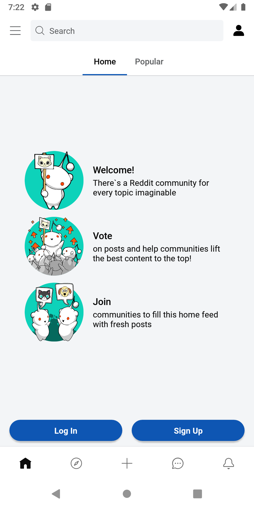

[](https://opensource.org/licenses/Apache-2.0) [](https://android-arsenal.com/api?level=21) [](https://github.com/fatih-ozturk/Reddity/actions/workflows/android.yml)

# Reddity (Stopped <strike>work-in-progress</strike> 🚧🛠️)

Reddity is a work-in-progress reddit clone app with Jetpack Compose which uses [Reddit API](https://www.reddit.com/dev/api/)

## Tech stack & libraries
- Jetpack;
    - [Compose](https://developer.android.com/jetpack/compose): A recommended modern toolkit for building native UI.
    - [ViewModel](https://developer.android.com/topic/libraries/architecture/viewmodel): A business logic or screen level state holder.
    - [Room](https://developer.android.com/training/data-storage/room): An abstraction layer over SQLite to allow fluent database access
    - [Navigation](https://developer.android.com/jetpack/compose/navigation): For navigating screens and [Hilt Navigation Compose](https://developer.android.com/jetpack/compose/libraries#hilt) for injecting dependencies.
    - [Paging 3](https://developer.android.com/topic/libraries/architecture/paging/v3-overview): Helps you load and display pages of data from a larger dataset from local storage or over network.
    - [DataStore](https://developer.android.com/topic/libraries/architecture/datastore): A data storage solution that allows you to store key-value pairs or typed objects with protocol buffers. 
- [Coroutines](https://developer.android.com/kotlin/coroutines) with [Flow](https://developer.android.com/kotlin/flow) for asynchronous.
- [Hilt](https://dagger.dev/hilt/): A standard way to incorporate [Dagger](https://github.com/google/dagger) dependency injection into an Android application.
- [Retrofit2](https://square.github.io/retrofit/ "Retrofit2"): A type-safe HTTP client for Android
- [OkHttp3](https://github.com/square/okhttp): An efficient HTTP & HTTP/2 client for Android
- [Moshi](https://github.com/square/moshi): A modern JSON library for Kotlin and Java.
- [Coil](https://github.com/coil-kt/coil): An image loading library for Android backed by Kotlin Coroutines. 
- [Timber](https://github.com/JakeWharton/timber): a logger with a small, extensible API which provides utility on top of Android's normal ```Log``` class.

## Architecture
The app follows the [official architecture guidance](https://developer.android.com/topic/architecture)
## Api key

Create an application on [Reddit apps](https://www.reddit.com/prefs/apps/) as script and obtain the secret keys then you can set them in ```~/secrets.properties``` to use login feature
```
REDDIT_CLIENT_ID="YOUR CLIENT ID"
REDDIT_CLIENT_SECRET="YOUR CLIENT SECRET"
```
## Screenshots

<p align="center">



</p>

## License

```
Copyright 2022 Fatih OZTURK

Licensed under the Apache License, Version 2.0 (the "License");
you may not use this file except in compliance with the License.
You may obtain a copy of the License at

    http://www.apache.org/licenses/LICENSE-2.0

Unless required by applicable law or agreed to in writing, software
distributed under the License is distributed on an "AS IS" BASIS,
WITHOUT WARRANTIES OR CONDITIONS OF ANY KIND, either express or implied.
See the License for the specific language governing permissions and
limitations under the License.
```
